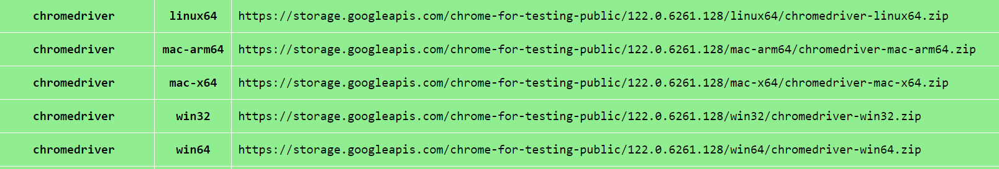

# opentowork
[](https://github.com/nguyenha1910/opentowork/actions/workflows/build_test.yml)
[](https://coveralls.io/github/nguyenha1910/opentowork?branch=main)

<a id="introduction"></a>
## Introduction

This repository hosts a comprehensive tool that helps job seekers in streamlining their job search process. The tool comprises a web application and data loader designed to provide job posting recommendations based on resume analysis, similarity scoring, and application status tracking.

## Table of Contents
* [Introduction](#introduction)
* [Key Features](#key-features)
* [Directory Overview](#directory-overview)
* [Dependencies & Installation](#installation)
  * [Environment](#environment)
  * [Data](#data)
  * [Application](#application)
* [Examples](#examples)

| Team Member  | GitHub                                   |
|------------------|--------------------------------------|
| Nguyen Ha         | [nguyenha1910](https://github.com/nguyenha1910)    |
| Kelly Wang       | [kellyzwang](https://github.com/kellyzwang)  |
| Elaine Zhang     | [ezhang17](https://github.com/ezhang17)|
| Janice Kim      | [ymkim814](https://github.com/ymkim814)|

<a id="key-features"></a>
## Key Features

* Web Scraper​: collects data science related job posting data from LinkedIn and Indeed.

* Resume/Job Description Skill Analyzer​: leverages spaCy's Named Entity Recognition (NER) and Entity Ruler, combined with a JSON file containing data-related skills, to extract skill keywords from resumes and job descriptions.

* Match Score Generator​: calculates a similarity score between each job posting and the user's resume using sentence embeddings generated by the SentenceTransformer library.

* Web App Interface: enables users to upload resumes, add or delete skills, and view job listings with match percentages and the presence of skills. Users can trigger the web scraper for updates and track application status.

<a id="directory-overview"></a>
## Directory Summary

**data**: All data used is accessible from the data folder. The job_listing_scraper.py writes out job posting data from LinkedIn and Indeed to a CSV file in the csvs folder. The pdfs folder stores resume PDFs uploaded by the user.

**doc**: Documentation for the project is found in this folder. This includes the files such as technology review presentation, component design, functional specification, and user stories.

**examples**: This folder contains documentation for the process of setting up, scraping data, and running the web app. A tutorial and a demo are also included.

**opentowork**: All python modules used in the project directory are found in this folder. Unit tests are also included for testable modules.

### Directory Structure
```
.
├── .github/workflows
|   └── build_test.yml
├── data
|   └── csvs
|       └── ...
|   └── pdfs
|       └── sample_resume.docx
|       └── sample_resume.pdf
|   └── jz_skill_patterns.jsonl
├── doc
|   └── DATA515 Technology Reviews.pptx
|   └── component_design.md
|   └── functional_specification.markdown
|   └── interaction_diagram.png
|   └── milestones.md
|   └── user_stories.md
├── examples
|   └── images
|       └── ...
|   └── README.md
|   └── scraper.md
|   └── streamlit_app.md
├── opentowork
|   └── pages
|       └── __init__.py
|       └── job_recommendation.py
|   └── scraper
|       └── __init__.py
|       └── get_jobs.py
|       └── job_listing_scraper.py
|   └── tests
|       └── __init__.py
|       └── test_get_jobs.py
|       └── test_scraper.py
|       └── test_sim_score.py
|       └── test_skill_extraction.py
|       └── test_streamlit.py
|   └── __init__.py
|   └── app.py
|   └── sim_score.py
|   └── skill_extraction.py
├── .coveragerc
├── .gitignore
├── LICENSE
├── README.md
├── config.yml
├── environment.yml
├── pyproject.toml
└── requirements.txt
```
<a id="installation"></a>
## Dependencies & Installation

<a id="environment"></a>
### Environment

1. Clone the environment using the `git` command below:
    ```bash
    git clone https://github.com/nguyenha1910/opentowork.git
    ```
2. Set up the `opentowork` Conda environment using the following commands:

    Create the environment (may take a couple minutes):
    ```bash
    conda env create -f environment.yml
    ```
    Activate the `opentowork` environment:
    ```bash
    conda activate opentowork
    ```
    To deactivate the `opentowork` environment:
    ```bash
    conda deactivate
    ```
    Note that these commands require Conda to work properly. Conda installation instructions can be found [here](https://docs.conda.io/projects/conda/en/stable/).

<a id="data"></a>
### Data

This app uses user-uploaded resumes (in PDF format on local computer) and scraped job listings from LinkedIn and Indeed.

The repository includes a sample resume (in [data/pdfs](/data/pdfs/)) and a base job listing dataset (in [data/csvs](/data/csvs/)).

To update the job listing dataset, the following additional requirements are needed and not included in the `opentowork` environment:
#### Google Chrome
For MacOS/Windows: If not already installed, install Google Chrome [here](https://www.google.com/chrome/). Using the latest version of Google Chrome is recommended.

For Linux: Check if Google Chrome is installed:
```bash
google-chrome --version
```
If already installed, update using the following commands:
```bash
sudo apt update
sudo apt upgrade google-chrome-stable
```
If not, install Google Chrome using these commands:
```bash
wget https://dl.google.com/linux/direct/google-chrome-stable_current_amd64.deb
sudo dpkg -i google-chrome-stable_current_amd64.deb
sudo apt install -f
```
Check that Google Chrome installed successfully:
```bash
google-chrome --version
```
#### Chromedriver
Chromedriver is necessary for running the scraping code and needs to match the Chrome version.
1. Find Google Chrome version

    For MacOS/Windows: To check Chrome version in the Chrome program itself, click the three dots at the upper right-hand corner, select Help at the very bottom, and click About Google Chrome. Update as needed.

    For Linux, run the following command:

    *This assumes that Chrome is installed in Linux
    ```bash
    google-chrome --version
    ```
2. Install the matching Chromedriver version

    Check if Chromedriver is already installed and matches the Chrome version:
    ```bash
    chromedriver --version
    ```

    If it's not installed or does not match your Chrome version, follow the following instructions:

    For Chrome versions 115 or newer, find the Chromedriver file URL [here](https://googlechromelabs.github.io/chrome-for-testing/).

    Make sure to copy the URL for "chromedriver" and your platform:
    

    For older Chrome versions, Chromedriver can be downloaded from [here](https://chromedriver.chromium.org/downloads).

    With the URL for the Chromedriver version, run the following code using your specified URL:
    ```bash
    # use your URL after chromedriver.zip
    curl -o chromedriver.zip <your_chromedriver_link_here>
    ```

    #### For MacOS/Linux:
    Unzip the file and find the unzipped folder name (should be something like chromedriver-linux64)
    ```bash
    unzip chromedriver.zip
    ls
    ```
    Move the chromedriver executable file to a directory in the opentowork environment PATH:
    ```bash
    # replace <chromedriver-youros> with the correct folder name and path
    conda activate opentowork
    mv <chromedriver-youros>/chromedriver $CONDA_PREFIX/bin/
    ```
    Check that Chromedriver is successfully installed:
    ```bash
    chromedriver --version
    ```
    #### For Windows:
    Activate powershell and unzip the chromedriver.zip file, then find the unzipped folder name (should be something like chromedriver-win64), replace <folder_of_your_choice> with where you want chromedriver.zip to unzip to:
    ```cmd
    powershell
    ```
    ```cmd
    Expand-Archive -Path chromedriver.zip -DestinationPath <folder_of_your_choice>
    ```
    ```cmd
    cd <folder_of_your_choice>
    dir
    ```
    Move the chromedriver executable file to a directory in the opentowork environment PATH, replace <chromedriver-win64> with the correct folder name:
    ```cmd
    conda activate opentowork
    ```
    ```cmd
    move <chromedriver-win64>\chromedriver %CONDA_PREFIX%\Scripts
    ```
    Check that Chromedriver is successfully installed:
    ```bash
    chromedriver --version
    ```
    More details on Chromedriver can be found [here](https://chromedriver.chromium.org/getting-started).
    Detailed documentation on our web scraping scripts can be found [here](/examples/scraper.md).

<a id="key-features"></a>
### Application

Our application uses `Streamlit`.
To run the app locally, run this command from the **root** folder:
```bash
conda activate opentowork
python -m streamlit run opentowork/app.py
```

<a id="examples"></a>
## Examples

Examples on installation, usage, and data can be found in the [examples directory](/examples/README.md).

A video demo of the app can be found [here](https://drive.google.com/file/d/1jhcOcOz5kY4p_G4Doxj_RliTtoBupCMR/view?usp=drive_link).
