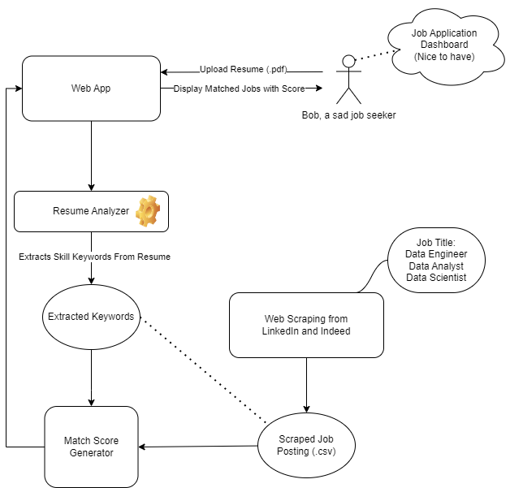

**User case: Viewing matched job postings**

1.  Web scraper

    a.  What it does: scrapes job listings related to "Data Scientist",
        "Data Analyst", "Data Engineer" from LinkedIn & Indeed and saves
        into csv files.

    b.  Input: job_title_input (a string); pages (a string) -- how many
        pages to scrape

    c.  Output: csv files of Data Science job listings

    d.  Assumptions: the job listings on LinkedIn & Indeed are
        trustworthy and relevant

2.  Resume analyzer

    a.  What it does: Analyze resume, extract keywords using Spacy, add
        keywords to profile

    b.  Input: User's resume in PDF format with standardized fonts,
        (nice to have: extra keywords from user input)

    c.  Output: Interface to upload resume to profile

    d.  Assumptions:

        i.  We will connect this data with database with username

        ii. The Resume has SKILLS section

3.  Match score generator for job recommendations

    a.  What it does: show a list of job posts fit user's profiles in
        descending order

    b.  Input:

        i.  Keywords extracted from resume

        ii. Job post list with job title, description, and other info

        iii. Filter: posted date, sponsorship

    c.  Output:

        i.  List of matched jobs based on the filter

    d.  Assumptions: The keyword appropriately reflects the resume
        (accuracy of keyword extraction)

4.  Web app interface

    a.  What it does: allows users to upload resume and displays job
        posts & their scores using Streamlit

    b.  Input: requires the scraped job post data, generated scores, and
        skills sets extracted from resume & added by user (nice to have)

    c.  Output: show a list of job posts that fits user's resume based
        on the score

Interaction Diagram:

1.  The Resume analyzer takes a resume as input as extract a list of
    skills as keywords to match with job posts.

2.  The Web scraper scrapes job postings from LinkedIn and Indeed.

3.  Match score generator for job recommendations generates score based
    on how much a job post matches with user's resume based on keywords.

4.  Web app interface displays a list of matching job posts in
    descending order based on the scores.
