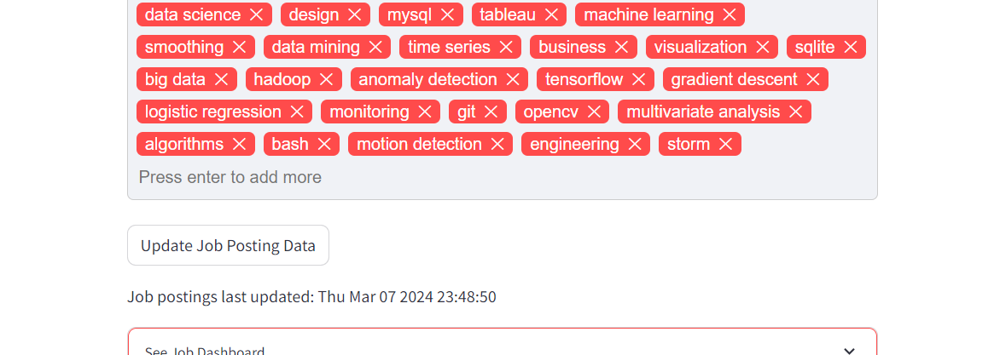

## Web Application Tutorial
Instructions on running the app locally can be found [here](README.md).
### View Jobs
Upload a resume (in PDF format) from your local files by clicking the "Browse files" button or dragging and dropping. A sample resume can be found in the [data/pdfs](../data/pdfs/) folder.

After uploading a resume, a list of skills will appear in the Skills box.

Check out the match scores and skill matches for each job posting by scrolling down on the page.
Apply to a job listing by clicking on the "Apply" button on the right-hand side. This will redirect you to the job post on LinkedIn/Indeed.

### Skill Analysis
Explore skill match with job listings by adding or removing skills in the Skills box.
Note that the match score percentage will not change, as it is calculated using the job description and not skills.

### Track Application Status
After applying, click "I applied!" at the bottom of the listing box to add it to the Job Dashboard. The company name, position title, location, status, and application date will be added to the Job Dashboard. The Job Dashboard can be found under the Update Job Posting Data button. Click to expand and minimize.

### Update Job Data
*All [additional requirements](../README.md#data) needed for web scraping need to be met to perform this action.

The job posting last updated date is displayed under the Skills box with the "Update Job Posting Data" button. To update job data, click the "Update Job Posting Data" button under the Skills box.

*Note that updating the data will take anywhere from 10-20 minutes to complete.

New job posting data will repopulate the page with updated match scores.

If the web scraping process is unable to fetch new jobs, it will show the following message:

We do not recommend trying to update the data more than twice daily.